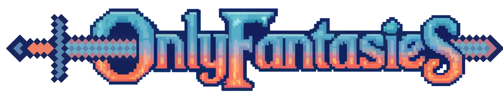
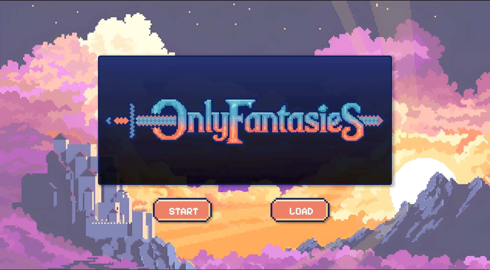
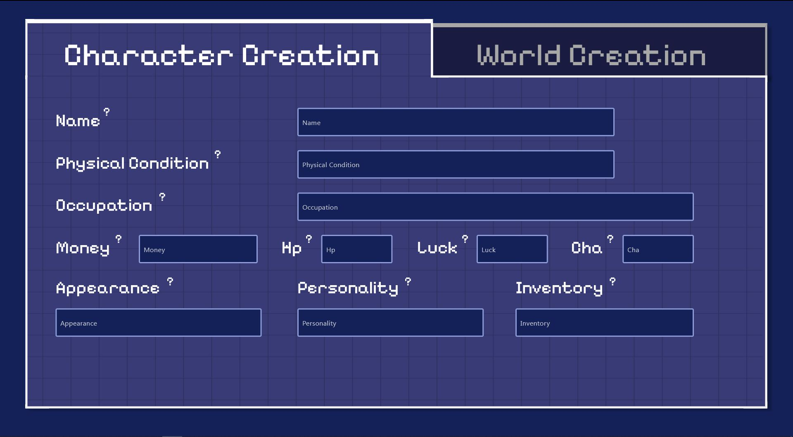
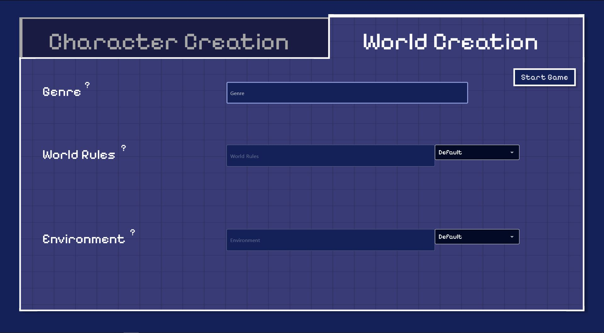
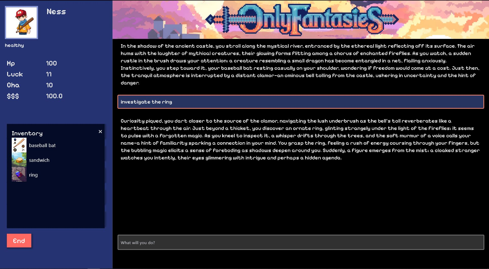
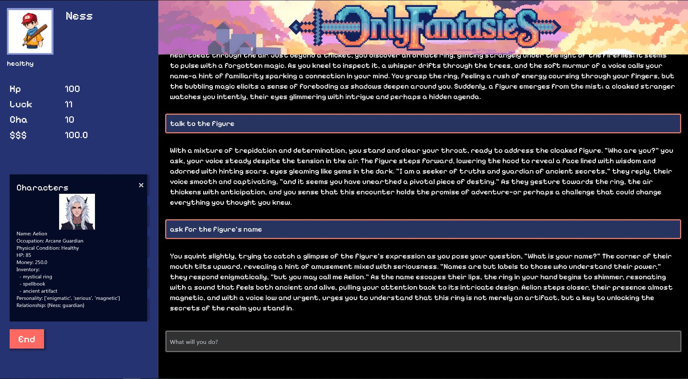
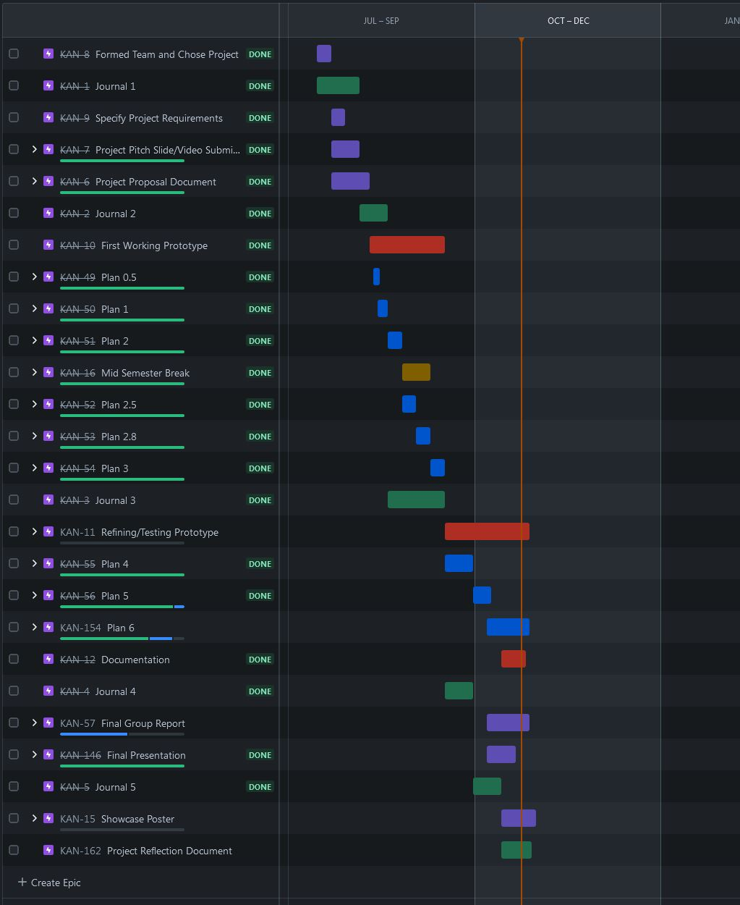

# OnlyFantasies

OnlyFantasies is a choose-your-adventure style game that leverages ChatGPT to generate fun and unique stories on every play-through. 
Users are able to create their own characters and define the world in which their story takes place.

<details>
    <summary>Screenshots of our project</summary>
    
    
    
    
    
</details>

# Team members

OnlyFantasies has been developed by these talented developers:

- Owen Li (Team lead, Backend lead)
- Andrew Sue (Tech lead, Frontend lead)
- Sarah Mah (Full stack developer)
- Lance Villanueva (Frontend developer)
- Becky Cheng (Frontend developer)
- Jia Xin Ye (Backend developer)

# Project Management tool

The project management tool we used for this project is [Jira](https://www.atlassian.com/software/jira). For tracking group meetings and client meetings, [Google Drive](https://drive.google.com) was used.

<details>
    <summary>Our Gantt Chart</summary>
    
</details>

# Technologies

For this project, we utilised the following technologies and libraries:

**Backend:**
- [Python 3.11](https://www.python.org/downloads/release/python-3110/)
- [OpenAI 1.41.1](https://openai.com/)
- [pydantic 2.8.2](https://docs.pydantic.dev/latest/)
- [typing-extension 4.12.2](https://pypi.org/project/typing-extensions/)
- [python-dotenv 1.0.1](https://pypi.org/project/python-dotenv/)

**Frontend:**
- [Flet 0.24.1](https://flet.dev/)
- [Pygame 2.6.1](https://www.pygame.org/news)
- [screeninfo 0.8.1](https://pypi.org/project/screeninfo/)
- [requests 2.32.3](https://pypi.org/project/requests/)
- [pillow 10.4.0](https://pypi.org/project/pillow/)

**Tests:**
- [Pytest 8.3.3](https://docs.pytest.org/en/stable/)
- [Pytest-asyncio 0.24.0](https://pypi.org/project/pytest-asyncio/)

# Installation

> [!WARNING]
> Please note that we highly recommend the user run this project on a 1920x1080 screen. It will work on higher resolutions but the format might be incorrect.
> This project also needs to be run on computers with **one** monitor only. Having more than one monitor will cause the project to look weird.
> From our testing, the lowest resolution this project can work on is a 1440x900 screen (MacBook Air M1).

We recommend running Python 3.11+ for this project, which can be downloaded [here](https://www.python.org/downloads/release/python-3110/).

After installing Python 3.11, clone this repository:

```
git clone https://github.com/uoa-compsci399-s2-2024/capstone-project-team-11
```

Next, navigate to the project folder:

```
cd capstone-project-team-11
```

Create a `.env` file at the root project directory with the following attributes:

 | Attribute      | Description                                                                                                                               |
|----------------|-------------------------------------------------------------------------------------------------------------------------------------------|
| OPENAI_API_KEY | Your OpenAI API key, this can be found on the [OpenAI website](https://platform.openai.com)                                               |
| HF_TOKEN       | Your Hugging Face token. More information on how to get the token can be found [here](https://huggingface.co/docs/hub/en/security-tokens) |

What your new `.env` file should look like:

```
OPENAI_API_KEY=YOUR-KEY-HERE
HF_TOKEN=YOUR-TOKEN-HERE
```


Next, create a virtual environment:

Windows:

```
python3.11 -m venv onlyfantasies_venv
\onlyfantasies_venv\Scripts\Activate.ps1
```

Mac:

```
python3.11 -m venv onlyfantasies_venv
source onlyfantasies_venv/bin/activate
```

After creating a virtual environment, install the requirements:

```
pip install -r requirements.txt 
```

Finally, run the project

```
python3 main.py
```

# Future Plans

For the future, we aim to implement the following features:

- Text to speech
- Using a better ChatGPT model
- AI-Generated background images
- Turn-based combat

# Acknowledgements

- Anna
- Asma
- Andrey
- Brenda
- Flet Documentations
- OpenAI API Documentations
- Everyone who helped test or tried our project :)
